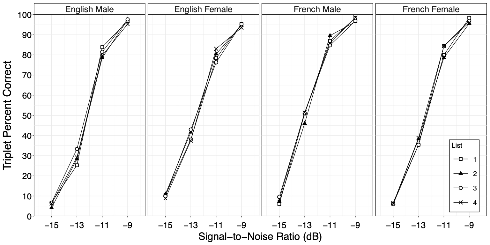
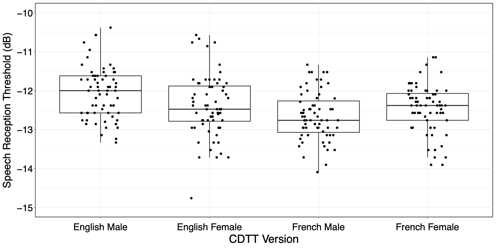

##### Read data
###### SRT dataset containing four language-talker versions
```{r}
data <- read.csv("CDTT_Phase 2_Adaptive_Data_2018.04.18.csv", header = TRUE)
data$List <- as.factor(data$List)
data$Group <- factor(data$Group, levels=c("English Male", "English Female", "French Male", "French Female"))
```

###### Create four subsets of data, by lamnguage-talker version
```{r}
eng_m <- subset(data, Group == "English Male")
eng_f <- subset(data, Group == "English Female")
french_m <- subset(data, Group == "French Male")
french_f <- subset(data, Group == "French Female")
```

##### Phase 2 ANOVA
- Repeated-measures, one-way analysis of variance; one ANOVA per language-talker version
- SRT is the outcome measure
- List is the within-subject factor

###### Check normality
```{r}
hist(eng_m$SRT)
shapiro.test(eng_m$SRT)
hist(eng_f$SRT)
shapiro.test(eng_f$SRT)
hist(french_m$SRT)
shapiro.test(french_m$SRT)
hist(french_f$SRT)
shapiro.test(french_f$SRT)
```

###### ANOVA for each language-talker version of CDTT
```{r}
summary(with(eng_m, aov(SRT ~ List + Error(factor(Participant)/List))))
summary(with(eng_f, aov(SRT ~ List + Error(factor(Participant)/List))))
summary(with(french_m, aov(SRT ~ List + Error(factor(Participant)/List))))
summary(with(french_f, aov(SRT ~ List + Error(factor(Participant)/List))))
```

###### Following up on List effect in English Female version
```{r}
tapply(eng_f$SRT, list(List = eng_f$List), mean)
with(eng_f, pairwise.t.test(SRT, List, paired=TRUE, p.adjust.method="holm"))
```

##### Figure 2



```{r}
data <- read.csv("CDTT_new_Figure_2_fixedSNR.csv", header=TRUE)
data$List <- as.factor(data$List)
data$Group <- factor(data$Group, levels=c("English Male", "English Female", "French Male", "French Female")) 

library(ggplot2)

ggplot(data, aes(x = SNR, y = Accuracy, group = List)) + 
  geom_line(aes(linetype = List), color = "black") +
  #scale_linetype_manual(values = c("solid", "longdash", "dashed", "twodash")) + 
  scale_linetype_manual(values = c("solid", "solid", "solid", "solid")) + 
  geom_point(size = 3, aes(shape = List, fill = List, stroke = 1.1)) + 
  scale_shape_manual(values = c(22, 17, 21, 4)) + 
  scale_color_manual(values = c("black", "black", "black", "black")) +
  scale_fill_manual(values = c("white", "black", "white", "black")) + 
  guides(fill = guide_legend(override.aes = list(stroke = 1.1))) + 
  facet_grid( ~ Group) + 
  scale_x_continuous(name = "Signal-to-Noise Ratio (dB)", limits = c(-16, -8), breaks = seq(-15,-9, 2)) + 
  scale_y_continuous(name = "Triplet Percent Correct", limits = c(0, 100), expand = c(0, 0), breaks = seq(0, 100, 10)) + 
  theme_bw() + 
  theme(axis.title.x = element_text(size = 24, colour = "black")) + 
  theme(axis.text.x = element_text(size = 20, colour = "black")) + 
  theme(axis.title.x = element_text(margin = margin(t = 15, r = 0, b = 0, l = 0))) + 
  theme(axis.title.y = element_text(size = 26, colour = "black")) +
  theme(axis.text.y = element_text(size = 20, colour = "black")) + 
  theme(axis.title.y = element_text(margin = margin(t = 0, r = 10, b = 0, l = 0))) +
  theme(axis.text.x.bottom = element_text(vjust = -1)) + 
  theme(plot.margin = unit(c(0.25, 0.25, 0.25, 0.25), "cm")) + 
  theme(legend.position = c(0.95, 0.2)) + 
  theme(legend.background = element_rect(fill = "white", color = "black")) + 
  theme(legend.title = element_text(size = 16, colour = "black")) +
  theme(legend.text = element_text(size = 16, colour = "black")) +
  theme(legend.key.size = unit(1.2, "cm")) + 
  theme(legend.key.width = unit(1.5, "cm")) + 
  theme(strip.text.x = element_text(size = 20)) + 
  theme(strip.background = element_rect(color = "black", fill="white", size=1.1, linetype="solid")) + 
  theme(panel.background = element_rect(color = "black", size = 1.1))
```


##### Figure 3


```{r}
data <- read.csv("CDTT_Phase 2_Adaptive_Data_2018.04.18.csv", header = TRUE)
data$List <- as.factor(data$List)
data$Group <- factor(data$Group, levels=c("English Male", "English Female", "French Male", "French Female"))

library(ggplot2)

ggplot(data, aes(x = Group, y = SRT)) + 
  geom_boxplot(outlier.shape=NA, lwd = 0.8, fatten = 1.4) + 
  geom_jitter(height = 0, width = 0.18, size = 2) + 
  coord_cartesian(xlim=c(1, 4), ylim=c(-15, -10)) + 
  xlab('CDTT Version') + 
  ylab('Speech Reception Threshold (dB)') + 
  theme_bw() + 
  theme(axis.title.x = element_text(size = 26)) + 
  theme(axis.text.x = element_text(size = 22, colour = "black")) + 
  theme(axis.title.x = element_text(margin = margin(t = 15, r = 0, b = 0, l = 0))) + 
  theme(axis.title.y = element_text(size = 24)) +
  theme(axis.text.y = element_text(size = 22, colour = "black")) + 
  theme(axis.title.y = element_text(margin = margin(t = 0, r = 10, b = 0, l = 0))) +
  theme(axis.text.x.bottom = element_text(vjust = -1)) + 
  theme(plot.margin = unit(c(0.25, 0.25, 0.25, 0.25), "cm")) + 
  theme(panel.background = element_rect(colour = "black", size = 1))
```


##### Reference

Giguère, C., Lagacé, J., Ellaham, N., Pichora-Fuller, M.K., Goy, H., Bégin, C., Alary, E., & Bowman, R. (2020). Development of the Canadian Digit Triplet Test in English and French. Journal of the Acoustical Society of America, 147, EL252. doi:10.1121/10.0000825 
